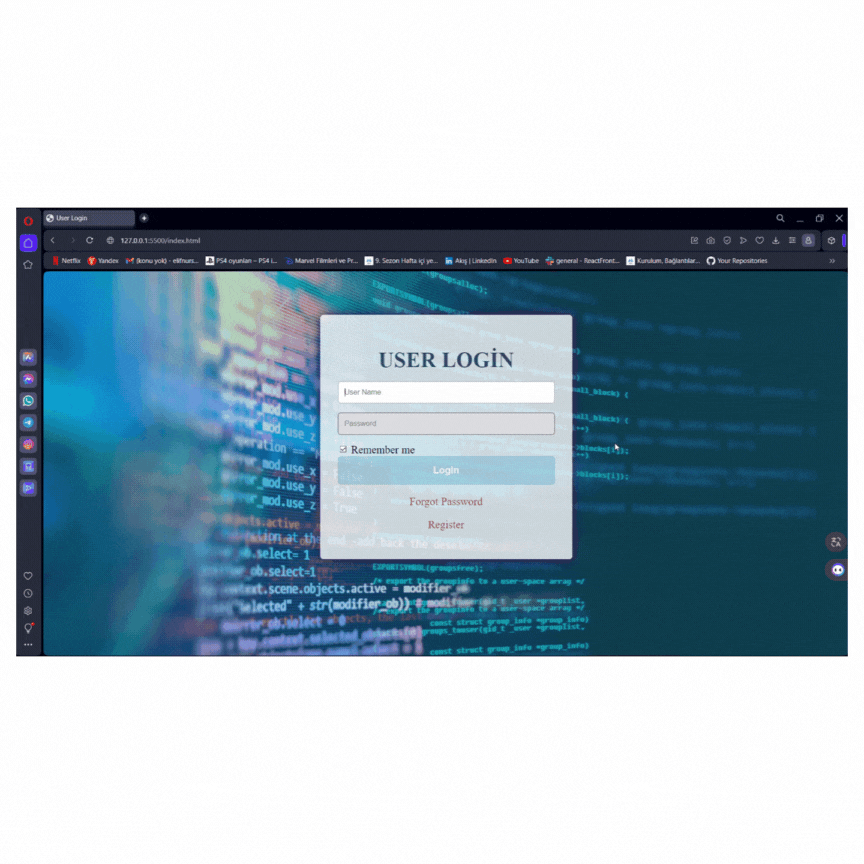

# login-register-panel

## Project Description
- This project includes a simple user login and register panel created using HTML and CSS. It has a basic interface design and provides users with the ability to log in and register.

## How to Run
- You can run the project by cloning it to your computer or downloading the ZIP file and following these steps:

1. Clone the repository to your computer: 'git clone https://github.com/username/trendyol-like-site.git' 
2. Navigate to the project directory: 'cd trendyol-like-site'
3. Open the 'index.html' file in a web browser.

## GIF

